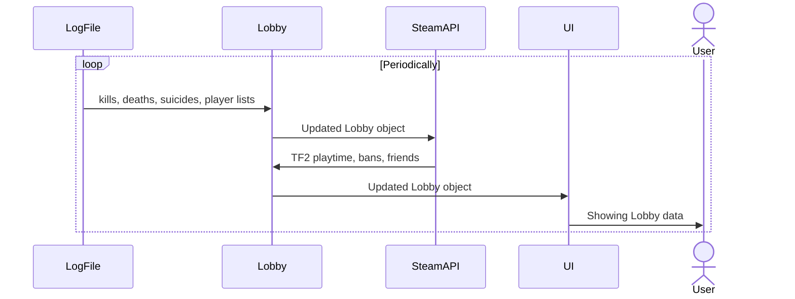

# Architecture notes

TF2Monitor is divided into parts such as rcon communication, logfile parsing, lobby management and UI.

These larger parts runs in their own threads and is communicating with the other parts of the app using message passing. See file [`AppBus`](/src/appbus.rs) for the specifics.

The following larger parts are in TF2Monitor:

- **LogFile**: Monitors and extracts data from TF2's console.log file which is then broadcasted.

- **Lobby**: Listens to broadcasts from LogFile and SteamAPI and maintains a Lobby object. The lobby data is periodically broadcasted. This lobby object is the single truth.

- **SteamAPI**: Recieves Lobby data, examines it, fetches data from cache or Steam Web API and broadcasts complementary data such as player friends, TF2 playtime, VAC bans.

  - Has a cache, in-memory for now.

- **RCON**: Sends `status` and `tf_lobby_debug` to TF2 periodically. Also listens to votekick messages and sends those to TF2. Due to bugs in TF2, the RCON part can also broadcast log file messages, right now only the output of `tf_lobby_debug`.

- **UI**: Listens to new Lobby data and presents it. Sends user commands such as votekick, player markings to other parts of the application.

