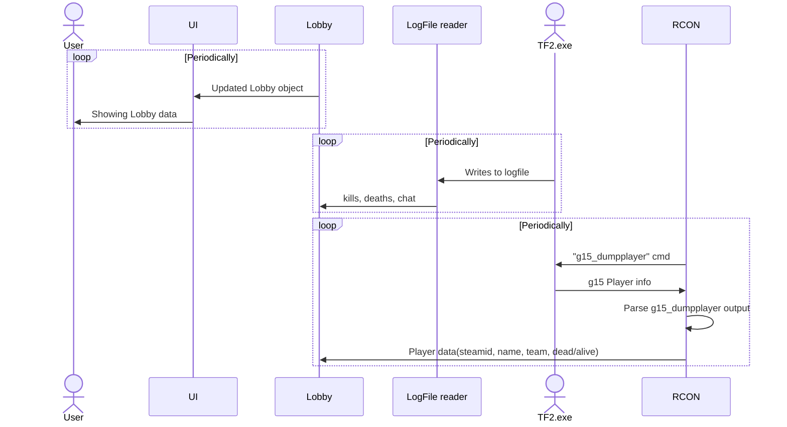
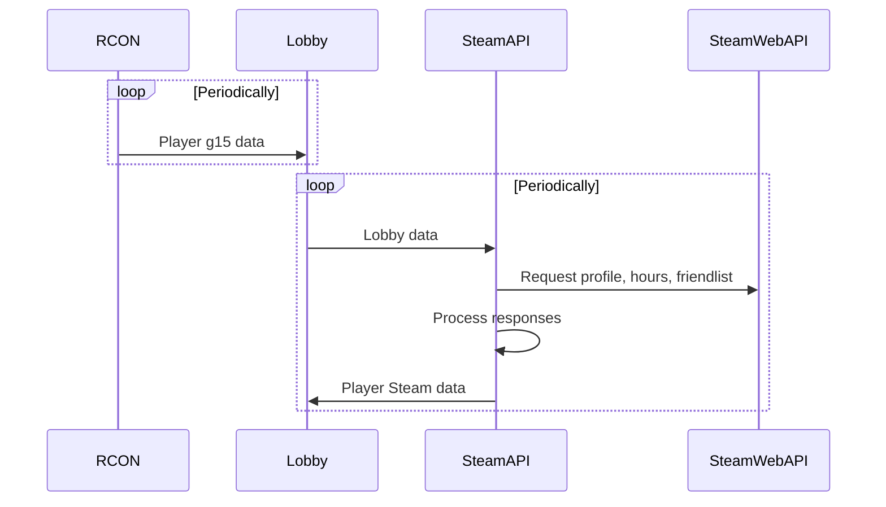
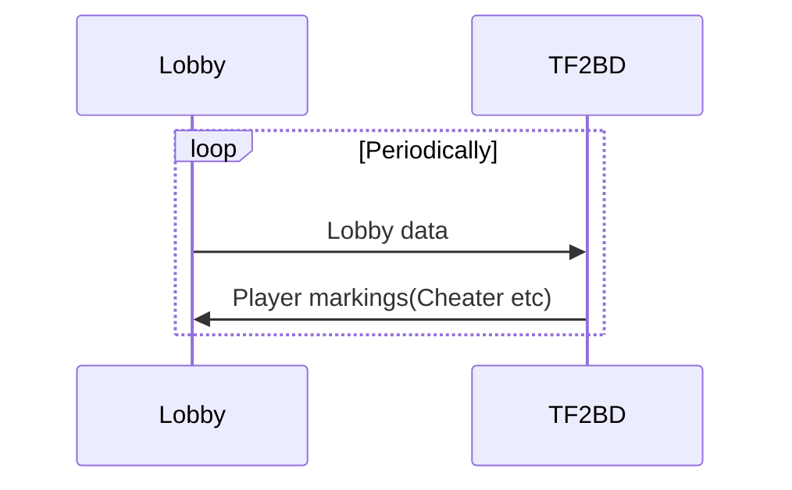
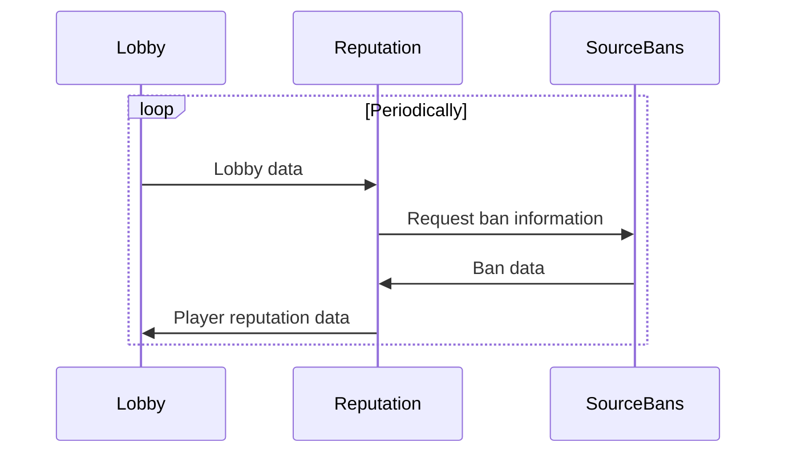

# Architecture notes

TF2Monitor is divided into parts such as rcon communication, logfile parsing, lobby management and UI.

These larger parts runs in their own threads and is communicating with the other parts of the app using message passing. See file [`AppBus`](/src/appbus.rs) for the specifics.

The following larger parts are in TF2Monitor:

- **LogFile**: Monitors and extracts data from TF2's console.log file which is then broadcasted.

- **Lobby**: Listens to broadcasts from LogFile, RCON and SteamAPI and maintains a Lobby object. The lobby data is periodically broadcasted. This lobby object is the single truth.

- **SteamAPI**: Recieves Lobby data, examines it, fetches data from cache or Steam Web API and broadcasts complementary data such as player friends, TF2 playtime, VAC bans.

  - Has a cache, in-memory for now.

- **RCON**: Sends `g15_dumpplayer` to TF2 periodically. Also listens to votekick messages and sends those to TF2.

- **TF2BD**: Listens to Lobby data and enriches it with the usual TF2BD markings such as Cheater, Toxic etc. Stores those markings in a `playerlist.json` file in the project root.

- **Reputation**: Listens to Lobby data and enriches it with reputation information from SourceBans. Fetches ban information for players and determines if they have a bad reputation.

- **UI**: Listens to new Lobby data and presents it. Sends user commands such as votekick, player markings to other parts of the application. Built with `egui` and `eframe`.

- **AppSettings**: Manages application configuration and persistence. Stores settings in `settings.json` including window position/size, RCON settings, Steam API key, and various UI preferences. Window position and size are automatically saved and restored between sessions.

## General data flow when playing

This is the general dataflow inside TF2Monitor when the player is just playing TF2 and have TF2Monitor window on second monitor.

## Enrich Lobby data with data from SteamAPI

This is the dataflow when the user joins a new TF2 server, or when a new player is joins the game. The player who a new to the Lobby will not have some data such as account age, TF2 hours, Steam friends. The SteamAPI loop will fetch missing data and send to Lobby.

## Enrich Lobby data with Cheater etc markings

This info is currently stored in the `playerlist.json` file.

## Enrich Lobby data with Reputation data

This flow enriches player data with SourceBans reputation information.

## UI Components

The UI is built using `egui` and `eframe` and consists of several modules:

- **scoreboard**: Main scoreboard display showing both teams
- **scoreboard_team**: Individual team scoreboard with player statistics (kills, deaths, hours, weapon, etc.)
- **chat**: Chat message display with team colors, dead/team prefixes, and translation support
- **kill_feed**: Kill feed display showing recent kills with critical hit indicators
- **player_details_panel**: Right-side panel showing detailed information about selected player
- **markings**: Player flag/marking display (Cheater, Bot, etc.)
- **playtime**: Player playtime display
- **account_age**: Account age display
- **friendship_indicators**: Visual indicators for Steam friends
- **top_menu**: Top menu bar with application controls
- **window_status_row**: Status row at the bottom of the window
- **player_tooltip**: Tooltip information for players
- **player_flag_editor**: Editor for player flags/markings
- **comments**: Steam profile comments display
- **recently_left**: Display of recently left players
- **background_image**: Background image handling
- **colors**: Color scheme and styling
- **ui_utils**: Common UI utility functions (e.g., `show_empty_value`)

### UI Features

- **Window Persistence**: Window position and size are automatically saved to `AppSettings` and restored on startup
- **Column Widths**: Scoreboard columns have minimum widths for consistent layout (Weapon: 100px, Kills: 50px, Deaths: 50px, Hours: 60px)
- **Chat Row Height**: Chat rows have adjustable height (default +3.5px extra spacing)
- **Critical Hit Display**: Kill feed shows "(crit)" after weapon name for critical hits
