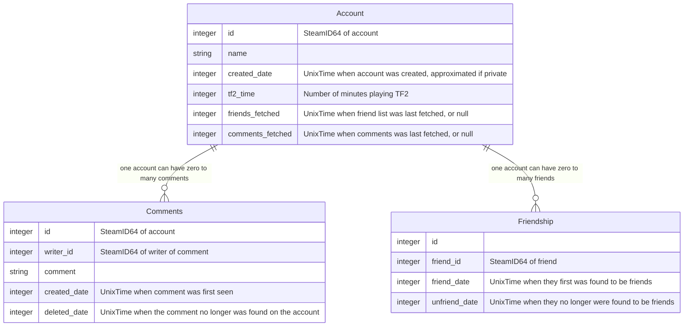

# Data model

## SteamWebAPI

This is the data model for data fetched from SteamWebAPi.

```mermaid
erDiagram
    Account {
        integer id "SteamID64 of account"
        string name
        integer created_date "UnixTime when account was created, approximated if private"
        integer tf2_time "Number of minutes playing TF2"

        integer friends_fetched "UnixTime when friend list was last fetched, or null"
        integer comments_fetched "UnixTime when comments was last fetched, or null"
    }

    Friendship {
        integer id
        integer friend_id "SteamID64 of friend"
        integer friend_date "UnixTime when they first was found to be friends"
        integer unfriend_date "UnixTime when they no longer were found to be friends"
    }

    Comments {
        integer id "SteamID64 of account"
        integer writer_id  "SteamID64 of writer of comment"
        string comment
        integer created_date "UnixTime when comment was first seen"
        integer deleted_date "UnixTime when the comment no longer was found on the account"
    }

    Account ||--o{ Comments : "one account can have zero to many comments"
    Account ||--o{ Friendship : "one account can have zero to many friends"

```
