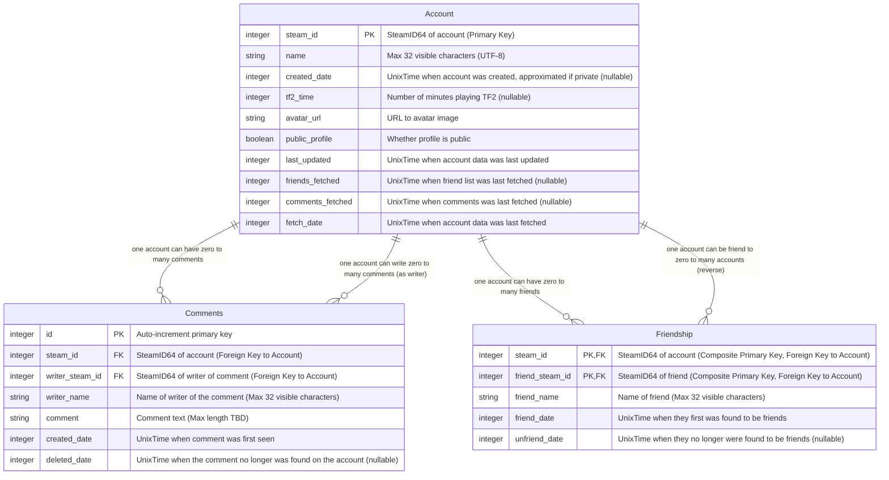

# Data model

## General Rules

- SQLite is the database engine used for this project.
- SeaORM is the database abstraction framework for this project.
- SteamID64 is stored as a 64-bit unsigned integer in the database. For SQLite this means an INTEGER.
- Names of accounts on Steam Community has a max length of 32 visible characters.
  - Due to UTF8 encoding, 32 emojis could use several bytes per char.
  - In the database the datatype TEXT will be used.

## SteamWebAPI

This is the data model for data fetched from SteamWebAPI.

**Status**: Planned (not yet implemented). Currently using in-memory caching (`SteamApiCache`).

**Primary Keys**:

- `Account.steam_id` (PRIMARY KEY)
- `Friendship`: Composite primary key (`steam_id`, `friend_steam_id`)
- `Comments`: Auto-increment `id` (PRIMARY KEY)

**Foreign Keys**:

- `Friendship.steam_id` → `Account.steam_id`
- `Friendship.friend_steam_id` → `Account.steam_id`
- `Comments.steam_id` → `Account.steam_id`
- `Comments.writer_steam_id` → `Account.steam_id`

**Indexes**:

- `Account.steam_id` (PRIMARY KEY, automatically indexed)
- `Friendship.steam_id` (INDEX for lookups by account)
- `Friendship.friend_steam_id` (INDEX for reverse lookups)
- `Comments.steam_id` (INDEX for lookups by account)
- `Comments.writer_steam_id` (INDEX for lookups by comment writer)
- `Comments.created_date` (INDEX for time-based queries)

**Constraints**:

- `Account.name`: TEXT, max 32 visible characters (UTF-8, variable byte length)
- `Friendship.friend_name`: TEXT, max 32 visible characters
- `Comments.writer_name`: TEXT, max 32 visible characters
- `Comments.comment`: TEXT, max length TBD (Steam API limit)

**Nullable Fields**:

- `Account.created_date`: NULL if profile is private and approximation failed
- `Account.tf2_time`: NULL if not available
- `Account.friends_fetched`: NULL if never fetched
- `Account.comments_fetched`: NULL if never fetched
- `Friendship.unfriend_date`: NULL if still friends
- `Comments.deleted_date`: NULL if comment still exists

## Migration Strategy

When implementing the database, data will need to be migrated from the current in-memory cache (`SteamApiCache`):

- **Account data**: From `summaries: HashMap<SteamID, PlayerSteamInfo>` → `Account` table
- **Friendship data**: From `friends: HashMap<SteamID, HashSet<SteamID>>` → `Friendship` table
- **Comments data**: From `comments: HashMap<SteamID, Vec<SteamProfileComment>>` → `Comments` table
- **Playtime data**: From `playtimes: HashMap<SteamID, Tf2PlayMinutes>` → `Account.tf2_time`

Migration scripts will be created to:

1. Create the database schema
2. Migrate existing cached data (if any)
3. Set up indexes and foreign key constraints
